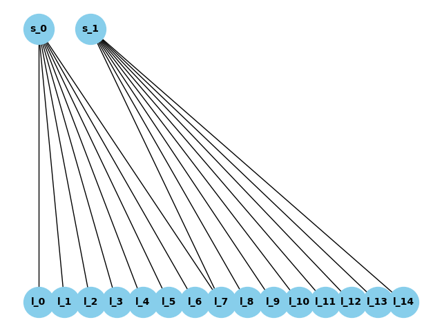

# Отчет о дизайне IP-фабрики в ЦОД по заданным параметрам

## Введение

В данном отчете представлены результаты расчетов центров обработки данных (ЦОД)
с использованием различных параметров, таких как количество портов клиентов,
коэффициент переподписки и тип spine.
Также сделан вывод об экономическом эффекте от коэффициента переподписки при масштабировании ЦОД.

### Параметры

Для расчетов использовались следующие параметры:

- Количество портов клиентов: [500, 1000, 1500, 2000, 3000, 4000, 5000, 8000, 10000]
- Коэффициент переподписки: [1, 2, 3, 4]
- Типы spine: 32 и 64 порта

## Расчеты ЦОД

Рассчитаем ЦОД для каждой комбинации параметров и приведем его стоимость в у. е.:

| Количество листьев | Количество связей лист-спайн | Количество спайнов | Параметры для расчета ЦОД                                                 | Стоимость в у.е. |
|--------------------|------------------------------|--------------------|---------------------------------------------------------------------------|------------------|
| 11	                | 44	                          | 2	                 | {'num_clients_ports': 500, 'cur_oversubscription': 1, 'cur_spine': 32}	   | 1184000          |
| 11	                | 44	                          | 2	                 | {'num_clients_ports': 500, 'cur_oversubscription': 1, 'cur_spine': 64}	   | 1214000          |
| 11	                | 22	                          | 2	                 | {'num_clients_ports': 500, 'cur_oversubscription': 2, 'cur_spine': 32}	   | 1162000          |
| 11	                | 22	                          | 2	                 | {'num_clients_ports': 500, 'cur_oversubscription': 2, 'cur_spine': 64}	   | 1192000          |
| 11	                | 22	                          | 2	                 | {'num_clients_ports': 500, 'cur_oversubscription': 3, 'cur_spine': 32}	   | 1162000          |
| 11	                | 22	                          | 2	                 | {'num_clients_ports': 500, 'cur_oversubscription': 3, 'cur_spine': 64}	   | 1192000          |
| 11	                | 11	                          | 2	                 | {'num_clients_ports': 500, 'cur_oversubscription': 4, 'cur_spine': 32}	   | 1151000          |
| 11	                | 11	                          | 2	                 | {'num_clients_ports': 500, 'cur_oversubscription': 4, 'cur_spine': 64}	   | 1181000          |
| 21	                | 84	                          | 2	                 | {'num_clients_ports': 1000, 'cur_oversubscription': 1, 'cur_spine': 32}	  | 2224000          |
| 21	                | 84	                          | 2	                 | {'num_clients_ports': 1000, 'cur_oversubscription': 1, 'cur_spine': 64}	  | 2254000          |
| 21	                | 42	                          | 2	                 | {'num_clients_ports': 1000, 'cur_oversubscription': 2, 'cur_spine': 32}	  | 2182000          |
| 21	                | 42	                          | 2	                 | {'num_clients_ports': 1000, 'cur_oversubscription': 2, 'cur_spine': 64}	  | 2212000          |
| 21	                | 42	                          | 2	                 | {'num_clients_ports': 1000, 'cur_oversubscription': 3, 'cur_spine': 32}	  | 2182000          |
| 21	                | 42	                          | 2	                 | {'num_clients_ports': 1000, 'cur_oversubscription': 3, 'cur_spine': 64}	  | 2212000          |
| 21	                | 21	                          | 2	                 | {'num_clients_ports': 1000, 'cur_oversubscription': 4, 'cur_spine': 32}	  | 2161000          |
| 21	                | 21	                          | 2	                 | {'num_clients_ports': 1000, 'cur_oversubscription': 4, 'cur_spine': 64}	  | 2191000          |
| 32	                | 128	                         | 2	                 | {'num_clients_ports': 1500, 'cur_oversubscription': 1, 'cur_spine': 32}	  | 3368000          |
| 32	                | 128	                         | 2	                 | {'num_clients_ports': 1500, 'cur_oversubscription': 1, 'cur_spine': 64}	  | 3398000          |
| 32	                | 64	                          | 2	                 | {'num_clients_ports': 1500, 'cur_oversubscription': 2, 'cur_spine': 32}	  | 3304000          |
| 32	                | 64	                          | 2	                 | {'num_clients_ports': 1500, 'cur_oversubscription': 2, 'cur_spine': 64}	  | 3334000          |
| 32	                | 64	                          | 2	                 | {'num_clients_ports': 1500, 'cur_oversubscription': 3, 'cur_spine': 32}	  | 3304000          |
| 32	                | 64	                          | 2	                 | {'num_clients_ports': 1500, 'cur_oversubscription': 3, 'cur_spine': 64}	  | 3334000          |
| 32	                | 32	                          | 2	                 | {'num_clients_ports': 1500, 'cur_oversubscription': 4, 'cur_spine': 32}	  | 3272000          |
| 32	                | 32	                          | 2	                 | {'num_clients_ports': 1500, 'cur_oversubscription': 4, 'cur_spine': 64}	  | 3302000          |
| 42	                | 168	                         | 2	                 | {'num_clients_ports': 2000, 'cur_oversubscription': 1, 'cur_spine': 32}	  | 4408000          |
| 42	                | 168	                         | 2	                 | {'num_clients_ports': 2000, 'cur_oversubscription': 1, 'cur_spine': 64}	  | 4438000          |
| 42	                | 84	                          | 2	                 | {'num_clients_ports': 2000, 'cur_oversubscription': 2, 'cur_spine': 32}	  | 4324000          |
| 42	                | 84	                          | 2	                 | {'num_clients_ports': 2000, 'cur_oversubscription': 2, 'cur_spine': 64}	  | 4354000          |
| 42	                | 84	                          | 2	                 | {'num_clients_ports': 2000, 'cur_oversubscription': 3, 'cur_spine': 32}	  | 4324000          |
| 42	                | 84	                          | 2	                 | {'num_clients_ports': 2000, 'cur_oversubscription': 3, 'cur_spine': 64}	  | 4354000          |
| 42	                | 42	                          | 2	                 | {'num_clients_ports': 2000, 'cur_oversubscription': 4, 'cur_spine': 32}	  | 4282000          |
| 42	                | 42	                          | 2	                 | {'num_clients_ports': 2000, 'cur_oversubscription': 4, 'cur_spine': 64}	  | 4312000          |
| 63	                | 252	                         | 2	                 | {'num_clients_ports': 3000, 'cur_oversubscription': 1, 'cur_spine': 32}	  | 6592000          |
| 63	                | 252	                         | 2	                 | {'num_clients_ports': 3000, 'cur_oversubscription': 1, 'cur_spine': 64}	  | 6622000          |
| 63	                | 126	                         | 2	                 | {'num_clients_ports': 3000, 'cur_oversubscription': 2, 'cur_spine': 32}	  | 6466000          |
| 63	                | 126	                         | 2	                 | {'num_clients_ports': 3000, 'cur_oversubscription': 2, 'cur_spine': 64}	  | 6496000          |
| 63	                | 126	                         | 2	                 | {'num_clients_ports': 3000, 'cur_oversubscription': 3, 'cur_spine': 32}	  | 6466000          |
| 63	                | 126	                         | 2	                 | {'num_clients_ports': 3000, 'cur_oversubscription': 3, 'cur_spine': 64}	  | 6496000          |
| 63	                | 63	                          | 2	                 | {'num_clients_ports': 3000, 'cur_oversubscription': 4, 'cur_spine': 32}	  | 6403000          |
| 63	                | 63	                          | 2	                 | {'num_clients_ports': 3000, 'cur_oversubscription': 4, 'cur_spine': 64}	  | 6433000          |
| 84	                | 336	                         | 3	                 | {'num_clients_ports': 4000, 'cur_oversubscription': 1, 'cur_spine': 32}	  | 8796000          |
| 84	                | 336	                         | 2	                 | {'num_clients_ports': 4000, 'cur_oversubscription': 1, 'cur_spine': 64}	  | 8806000          |
| 84	                | 168	                         | 3	                 | {'num_clients_ports': 4000, 'cur_oversubscription': 2, 'cur_spine': 32}	  | 8628000          |
| 84	                | 168	                         | 2	                 | {'num_clients_ports': 4000, 'cur_oversubscription': 2, 'cur_spine': 64}	  | 8638000          |
| 84	                | 168	                         | 3	                 | {'num_clients_ports': 4000, 'cur_oversubscription': 3, 'cur_spine': 32}	  | 8628000          |
| 84	                | 168	                         | 2	                 | {'num_clients_ports': 4000, 'cur_oversubscription': 3, 'cur_spine': 64}	  | 8638000          |
| 84	                | 84	                          | 3	                 | {'num_clients_ports': 4000, 'cur_oversubscription': 4, 'cur_spine': 32}	  | 8544000          |
| 84	                | 84	                          | 2	                 | {'num_clients_ports': 4000, 'cur_oversubscription': 4, 'cur_spine': 64}	  | 8554000          |
| 105	               | 420	                         | 4	                 | {'num_clients_ports': 5000, 'cur_oversubscription': 1, 'cur_spine': 32}	  | 11000000         |
| 105	               | 420	                         | 2	                 | {'num_clients_ports': 5000, 'cur_oversubscription': 1, 'cur_spine': 64}	  | 10990000         |
| 105	               | 210	                         | 4	                 | {'num_clients_ports': 5000, 'cur_oversubscription': 2, 'cur_spine': 32}	  | 10790000         |
| 105	               | 210	                         | 2	                 | {'num_clients_ports': 5000, 'cur_oversubscription': 2, 'cur_spine': 64}	  | 10780000         |
| 105	               | 210	                         | 4	                 | {'num_clients_ports': 5000, 'cur_oversubscription': 3, 'cur_spine': 32}	  | 10790000         |
| 105	               | 210	                         | 2	                 | {'num_clients_ports': 5000, 'cur_oversubscription': 3, 'cur_spine': 64}	  | 10780000         |
| 105	               | 105	                         | 4	                 | {'num_clients_ports': 5000, 'cur_oversubscription': 4, 'cur_spine': 32}	  | 10685000         |
| 105	               | 105	                         | 2	                 | {'num_clients_ports': 5000, 'cur_oversubscription': 4, 'cur_spine': 64}	  | 10675000         |
| 167	               | 668	                         | 6	                 | {'num_clients_ports': 8000, 'cur_oversubscription': 1, 'cur_spine': 32}	  | 17488000         |
| 167	               | 668	                         | 3	                 | {'num_clients_ports': 8000, 'cur_oversubscription': 1, 'cur_spine': 64}	  | 17473000         |
| 167	               | 334	                         | 6	                 | {'num_clients_ports': 8000, 'cur_oversubscription': 2, 'cur_spine': 32}	  | 17154000         |
| 167	               | 334	                         | 3	                 | {'num_clients_ports': 8000, 'cur_oversubscription': 2, 'cur_spine': 64}	  | 17139000         |
| 167	               | 334	                         | 6	                 | {'num_clients_ports': 8000, 'cur_oversubscription': 3, 'cur_spine': 32}	  | 17154000         |
| 167	               | 334	                         | 3	                 | {'num_clients_ports': 8000, 'cur_oversubscription': 3, 'cur_spine': 64}	  | 17139000         |
| 167	               | 167	                         | 6	                 | {'num_clients_ports': 8000, 'cur_oversubscription': 4, 'cur_spine': 32}	  | 16987000         |
| 167	               | 167	                         | 3	                 | {'num_clients_ports': 8000, 'cur_oversubscription': 4, 'cur_spine': 64}	  | 16972000         |
| 209	               | 836	                         | 7	                 | {'num_clients_ports': 10000, 'cur_oversubscription': 1, 'cur_spine': 32}	 | 21876000         |
| 209	               | 836	                         | 4	                 | {'num_clients_ports': 10000, 'cur_oversubscription': 1, 'cur_spine': 64}	 | 21876000         |
| 209	               | 418	                         | 7	                 | {'num_clients_ports': 10000, 'cur_oversubscription': 2, 'cur_spine': 32}	 | 21458000         |
| 209	               | 418	                         | 4	                 | {'num_clients_ports': 10000, 'cur_oversubscription': 2, 'cur_spine': 64}	 | 21458000         |
| 209	               | 418	                         | 7	                 | {'num_clients_ports': 10000, 'cur_oversubscription': 3, 'cur_spine': 32}	 | 21458000         |
| 209	               | 418	                         | 4	                 | {'num_clients_ports': 10000, 'cur_oversubscription': 3, 'cur_spine': 64}	 | 21458000         |
| 209	               | 209	                         | 7	                 | {'num_clients_ports': 10000, 'cur_oversubscription': 4, 'cur_spine': 32}	 | 21249000         |
| 209	               | 209	                         | 4	                 | {'num_clients_ports': 10000, 'cur_oversubscription': 4, 'cur_spine': 64}	 | 21249000         |

Всего было произведено 72 расчета, т. е. учтены все возможные конфигурации по заданным параметрам.

## Визуализация
Здесь приведу результат работы скрипта по визуализации для ЦОД со следующими параметрами:
{num_leafs=15, num_leaf_spine_links=2, num_spine=2}

Визуализация получилась довольно схематичная, однако она хорошо иллюстрирует Fat tree архитектуру

## Экономический эффект коэффициента переподписки при масштабировании
Теперь для каждого рассчитанного выше ЦОД приведем стоимость его масштабирования вдвое (по количеству клиентских портов)

(Чтобы не захламлять отчет привожу расчеты лишь для варианта spine64)

| Коэффициент переподписки в новом (масштабированном ЦОД) | Стоимость масштабирования (в у.е.) | Коэффициент переподписки в новом (масштабированном ЦОД) | Стоимость масштабирования (в у.е.) | Коэффициент переподписки в новом (масштабированном ЦОД) | Стоимость масштабирования (в у.е.) | Коэффициент переподписки в новом (масштабированном ЦОД) | Стоимость масштабирования (в у.е.) |
|---------------------------------------------------------|------------------------------------|---------------------------------------------------------|------------------------------------|---------------------------------------------------------|------------------------------------|---------------------------------------------------------|------------------------------------|
| 1                                                       | 1070000                            | 2                                                       | 1028000                            | 3                                                       | 1028000                            | 4                                                       | 1007000                            |
| 1                                                       | 1040000                            | 2                                                       | 998000                             | 3                                                       | 998000                             | 4                                                       | 977000                             |
| 1                                                       | 1092000                            | 2                                                       | 1050000                            | 3                                                       | 1050000                            | 4                                                       | 1029000                            |
| 1                                                       | 1062000                            | 2                                                       | 1020000                            | 3                                                       | 1020000                            | 4                                                       | 999000                             |
| 1                                                       | 1092000                            | 2                                                       | 1050000                            | 3                                                       | 1050000                            | 4                                                       | 1029000                            |
| 1                                                       | 1062000                            | 2                                                       | 1020000                            | 3                                                       | 1020000                            | 4                                                       | 999000                             |
| 1                                                       | 1103000                            | 2                                                       | 1061000                            | 3                                                       | 1061000                            | 4                                                       | 1040000                            |
| 1                                                       | 1073000                            | 2                                                       | 1031000                            | 3                                                       | 1031000                            | 4                                                       | 1010000                            |
| 1                                                       | 2214000                            | 2                                                       | 2130000                            | 3                                                       | 2130000                            | 4                                                       | 2088000                            |
| 1                                                       | 2184000                            | 2                                                       | 2100000                            | 3                                                       | 2100000                            | 4                                                       | 2058000                            |
| 1                                                       | 2256000                            | 2                                                       | 2172000                            | 3                                                       | 2172000                            | 4                                                       | 2130000                            |
| 1                                                       | 2226000                            | 2                                                       | 2142000                            | 3                                                       | 2142000                            | 4                                                       | 2100000                            |
| 1                                                       | 2256000                            | 2                                                       | 2172000                            | 3                                                       | 2172000                            | 4                                                       | 2130000                            |
| 1                                                       | 2226000                            | 2                                                       | 2142000                            | 3                                                       | 2142000                            | 4                                                       | 2100000                            |
| 1                                                       | 2277000                            | 2                                                       | 2193000                            | 3                                                       | 2193000                            | 4                                                       | 2151000                            |
| 1                                                       | 2247000                            | 2                                                       | 2163000                            | 3                                                       | 2163000                            | 4                                                       | 2121000                            |
| 1                                                       | 3254000                            | 2                                                       | 3128000                            | 3                                                       | 3128000                            | 4                                                       | 3065000                            |
| 1                                                       | 3224000                            | 2                                                       | 3098000                            | 3                                                       | 3098000                            | 4                                                       | 3035000                            |
| 1                                                       | 3318000                            | 2                                                       | 3192000                            | 3                                                       | 3192000                            | 4                                                       | 3129000                            |
| 1                                                       | 3288000                            | 2                                                       | 3162000                            | 3                                                       | 3162000                            | 4                                                       | 3099000                            |
| 1                                                       | 3318000                            | 2                                                       | 3192000                            | 3                                                       | 3192000                            | 4                                                       | 3129000                            |
| 1                                                       | 3288000                            | 2                                                       | 3162000                            | 3                                                       | 3162000                            | 4                                                       | 3099000                            |
| 1                                                       | 3350000                            | 2                                                       | 3224000                            | 3                                                       | 3224000                            | 4                                                       | 3161000                            |
| 1                                                       | 3320000                            | 2                                                       | 3194000                            | 3                                                       | 3194000                            | 4                                                       | 3131000                            |
| 1                                                       | 4398000                            | 2                                                       | 4230000                            | 3                                                       | 4230000                            | 4                                                       | 4146000                            |
| 1                                                       | 4368000                            | 2                                                       | 4200000                            | 3                                                       | 4200000                            | 4                                                       | 4116000                            |
| 1                                                       | 4482000                            | 2                                                       | 4314000                            | 3                                                       | 4314000                            | 4                                                       | 4230000                            |
| 1                                                       | 4452000                            | 2                                                       | 4284000                            | 3                                                       | 4284000                            | 4                                                       | 4200000                            |
| 1                                                       | 4482000                            | 2                                                       | 4314000                            | 3                                                       | 4314000                            | 4                                                       | 4230000                            |
| 1                                                       | 4452000                            | 2                                                       | 4284000                            | 3                                                       | 4284000                            | 4                                                       | 4200000                            |
| 1                                                       | 4524000                            | 2                                                       | 4356000                            | 3                                                       | 4356000                            | 4                                                       | 4272000                            |
| 1                                                       | 4494000                            | 2                                                       | 4326000                            | 3                                                       | 4326000                            | 4                                                       | 4242000                            |
| 1                                                       | 6478000                            | 2                                                       | 6228000                            | 3                                                       | 6228000                            | 4                                                       | 6103000                            |
| 1                                                       | 6448000                            | 2                                                       | 6198000                            | 3                                                       | 6198000                            | 4                                                       | 6073000                            |
| 1                                                       | 6604000                            | 2                                                       | 6354000                            | 3                                                       | 6354000                            | 4                                                       | 6229000                            |
| 1                                                       | 6574000                            | 2                                                       | 6324000                            | 3                                                       | 6324000                            | 4                                                       | 6199000                            |
| 1                                                       | 6604000                            | 2                                                       | 6354000                            | 3                                                       | 6354000                            | 4                                                       | 6229000                            |
| 1                                                       | 6574000                            | 2                                                       | 6324000                            | 3                                                       | 6324000                            | 4                                                       | 6199000                            |
| 1                                                       | 6667000                            | 2                                                       | 6417000                            | 3                                                       | 6417000                            | 4                                                       | 6292000                            |
| 1                                                       | 6637000                            | 2                                                       | 6387000                            | 3                                                       | 6387000                            | 4                                                       | 6262000                            |
| 1                                                       | 8677000                            | 2                                                       | 8343000                            | 3                                                       | 8343000                            | 4                                                       | 8176000                            |
| 1                                                       | 8667000                            | 2                                                       | 8333000                            | 3                                                       | 8333000                            | 4                                                       | 8166000                            |
| 1                                                       | 8845000                            | 2                                                       | 8511000                            | 3                                                       | 8511000                            | 4                                                       | 8344000                            |
| 1                                                       | 8835000                            | 2                                                       | 8501000                            | 3                                                       | 8501000                            | 4                                                       | 8334000                            |
| 1                                                       | 8845000                            | 2                                                       | 8511000                            | 3                                                       | 8511000                            | 4                                                       | 8344000                            |
| 1                                                       | 8835000                            | 2                                                       | 8501000                            | 3                                                       | 8501000                            | 4                                                       | 8334000                            |
| 1                                                       | 8929000                            | 2                                                       | 8595000                            | 3                                                       | 8595000                            | 4                                                       | 8428000                            |
| 1                                                       | 8919000                            | 2                                                       | 8585000                            | 3                                                       | 8585000                            | 4                                                       | 8418000                            |
| 1                                                       | 10876000                           | 2                                                       | 10458000                           | 3                                                       | 10458000                           | 4                                                       | 10249000                           |
| 1                                                       | 10886000                           | 2                                                       | 10468000                           | 3                                                       | 10468000                           | 4                                                       | 10259000                           |
| 1                                                       | 11086000                           | 2                                                       | 10668000                           | 3                                                       | 10668000                           | 4                                                       | 10459000                           |
| 1                                                       | 11096000                           | 2                                                       | 10678000                           | 3                                                       | 10678000                           | 4                                                       | 10469000                           |
| 1                                                       | 11086000                           | 2                                                       | 10668000                           | 3                                                       | 10668000                           | 4                                                       | 10459000                           |
| 1                                                       | 11096000                           | 2                                                       | 10678000                           | 3                                                       | 10678000                           | 4                                                       | 10469000                           |
| 1                                                       | 11191000                           | 2                                                       | 10773000                           | 3                                                       | 10773000                           | 4                                                       | 10564000                           |
| 1                                                       | 11201000                           | 2                                                       | 10783000                           | 3                                                       | 10783000                           | 4                                                       | 10574000                           |
| 1                                                       | 17458000                           | 2                                                       | 16790000                           | 3                                                       | 16790000                           | 4                                                       | 16456000                           |
| 1                                                       | 17473000                           | 2                                                       | 16805000                           | 3                                                       | 16805000                           | 4                                                       | 16471000                           |
| 1                                                       | 17792000                           | 2                                                       | 17124000                           | 3                                                       | 17124000                           | 4                                                       | 16790000                           |
| 1                                                       | 17807000                           | 2                                                       | 17139000                           | 3                                                       | 17139000                           | 4                                                       | 16805000                           |
| 1                                                       | 17792000                           | 2                                                       | 17124000                           | 3                                                       | 17124000                           | 4                                                       | 16790000                           |
| 1                                                       | 17807000                           | 2                                                       | 17139000                           | 3                                                       | 17139000                           | 4                                                       | 16805000                           |
| 1                                                       | 17959000                           | 2                                                       | 17291000                           | 3                                                       | 17291000                           | 4                                                       | 16957000                           |
| 1                                                       | 17974000                           | 2                                                       | 17306000                           | 3                                                       | 17306000                           | 4                                                       | 16972000                           |
| 1                                                       | 21737000                           | 2                                                       | 20903000                           | 3                                                       | 20903000                           | 4                                                       | 20486000                           |
| 1                                                       | 21737000                           | 2                                                       | 20903000                           | 3                                                       | 20903000                           | 4                                                       | 20486000                           |
| 1                                                       | 22155000                           | 2                                                       | 21321000                           | 3                                                       | 21321000                           | 4                                                       | 20904000                           |
| 1                                                       | 22155000                           | 2                                                       | 21321000                           | 3                                                       | 21321000                           | 4                                                       | 20904000                           |
| 1                                                       | 22155000                           | 2                                                       | 21321000                           | 3                                                       | 21321000                           | 4                                                       | 20904000                           |
| 1                                                       | 22155000                           | 2                                                       | 21321000                           | 3                                                       | 21321000                           | 4                                                       | 20904000                           |
| 1                                                       | 22364000                           | 2                                                       | 21530000                           | 3                                                       | 21530000                           | 4                                                       | 21113000                           |
| 1                                                       | 22364000                           | 2                                                       | 21530000                           | 3                                                       | 21530000                           | 4                                                       | 21113000                           |

Как видно из представленных вычислений, переподписка может как иметь положительный экономический эффект, так и нет.
Это зависит от многих параметров, в частности от того, во сколько раз мы хотим расширить ЦОД, с какой переподпиской будет новый ЦОД,
какой тип Spine мы выберем и, конечно, от того, какая переподписка закладывалась в изначальном ЦОДе.

Итак, принимая решение о том, какую переподписку делать, нужно понимать, насколько масштабное расширение планируется в будущем.